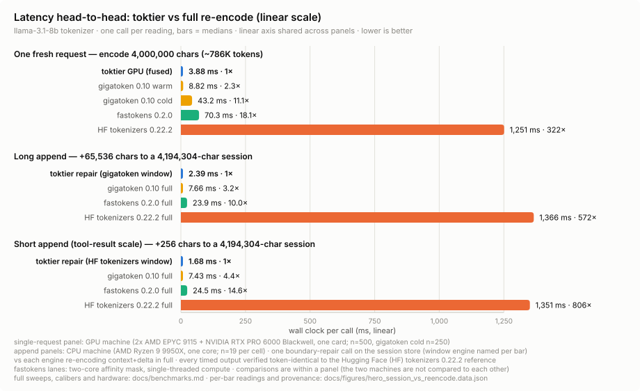
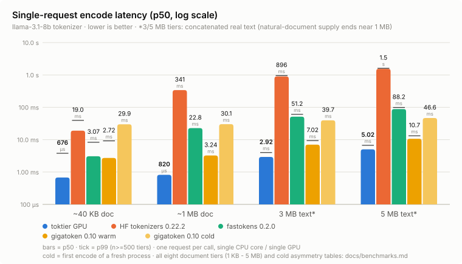
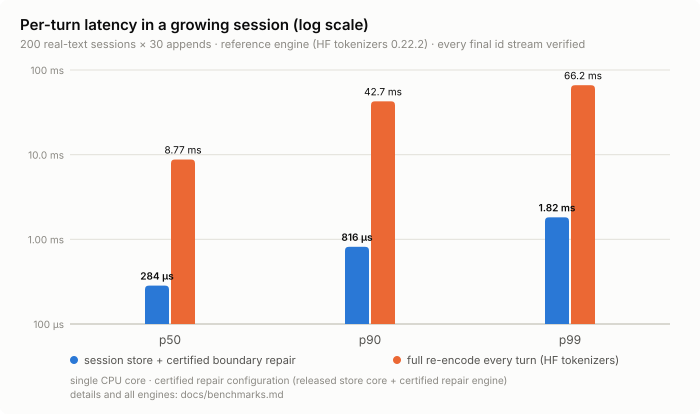
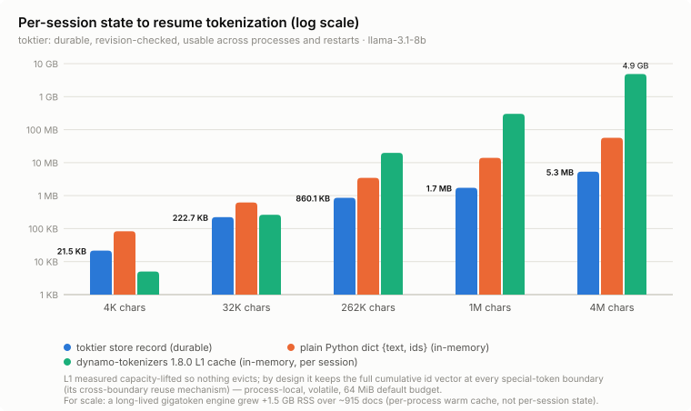
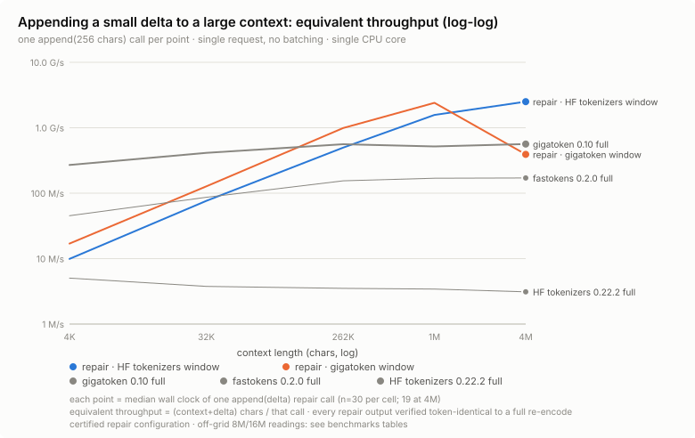

# toktier

**English** | [简体中文](README.zh-CN.md)

**Tokenize the conversation once — after that, only what's new.**

TokTier is a stateful tokenization system for agentic LLM serving. It keeps
per-session token state, repairs appended text with a certified CPU path, and
offers a certified GPU path for fresh or large requests. Both fast paths return token IDs
**bit-identical to a full Hugging Face (HF) `tokenizers` encode from scratch**.

- **Exact, at scale.** The release campaign records **57.0 billion checks**
  across 15 tokenizer artifacts and 3.8 billion real documents
  (12.33 trillion characters), with zero observed divergence.
- **Fast on both paths.** On the recorded benchmark battery, the GPU path
  encodes a fresh 4-million-character request (~786K tokens) in **3.88 ms**,
  and the bounded CPU repair for a 256-character append to a
  4.19M-character session takes **1.68 ms**. The
  [benchmark protocol](docs/benchmarks.md) excludes engine construction,
  so the **3.88 ms** result assumes an already constructed and prepared
  engine; it is not a cold first-call figure. The repair reading measures the repair
  operation itself; it excludes materializing the full historical token
  sequence as a Python tuple.
- **Certified before acceleration.** Fast paths are admitted only for the exact
  tokenizer artifact, oracle version, kernel delivery, and architecture covered
  by recorded evidence. `explain()` reports the route and its reasons.

<picture>
  <source media="(prefers-color-scheme: dark)"
          srcset="docs/figures/hero_session_vs_reencode_dark.svg">
  
</picture>

Every bar is a measured median. The 1.68 ms reading above comes from the
`toktier repair (HF tokenizers window)` lane, which is the repair window
measured in that cell; the corrected-Gigatoken window is a separate lane in the
same figure (2.39 ms on the 65,536-character append). Both are bounded repairs
under the routing table below, and the figure data names the lane of each bar.
A native Rust serving integration can avoid the full-sequence materialization
by retaining session state and consuming only the repaired suffix. Exact
values, workload sizes, and sample counts are in
[`hero_session_vs_reencode.data.json`](docs/figures/hero_session_vs_reencode.data.json);
the complete sweeps are in [`docs/benchmarks.md`](docs/benchmarks.md).

## News

- **2026.08.27** 🚀 **toktier 0.2.7** released — `pip install
  "toktier[fastokens]"` now installs `toktier-fastokens`, a pinned build of
  fastokens 0.3.1 with five patches from this project. The project publishes
  the build, so the extra installs the same bytes described by the adapter's
  readings.
  The adapter resolves the installed engine by its import package and
  reports `engine_assurance`, while its admission remains `experimental`.
  For the published wheel, the report shows `certified_pinned`
  with a guarded `exact_id_guarantee: true`; otherwise, it identifies the
  premise that does not hold. The 154-code-point Unicode guard moved from
  the judge into the adapter. Served
  IDs, the store format, and the kernel ABI are unchanged. See the
  [v0.2.7 release notes](docs/releases/v0.2.7.md).
- **2026.08.27** 🚀 **toktier 0.2.6** released — Rust certification now
  speaks for the certified core (TokTier's own crates, the packages they call
  directly, and the text-semantics libraries beneath them). Drift elsewhere in
  the compiled closure is reported as an advisory with alignment commands and
  no longer withholds acceleration. The whole-closure reading stays available
  as `dependency_closure`. The libraries whose Unicode tables decide where
  text is cut are compared by the version of those tables rather than by their
  package version, and `doctor` reports each one. The property data the fast
  CPU pre-tokenizer reads is pinned to the Unicode version the reference
  engine carries, with an exhaustive gate that keeps the two equal. On the
  GPU side, driver and CUDA versions are reported as environment facts, and
  `sm_80` and `sm_90` join the certified prebuilt list on a bounded spot
  check. A device architecture or compiler toolchain unjudged by any campaign
  now runs under the new default `supported` policy and is labelled
  `supported_untested`. `verify-local` (the same command on both
  faces) compares such a route with the reference engine on your own
  text and records the answer as `locally_verified`. Served
  IDs, the store format, and the kernel ABI are unchanged. See the
  [v0.2.6 release notes](docs/releases/v0.2.6.md).
- **2026.08.15** 🚀 **toktier 0.2.5** released — the Rust crate's `network`
  feature is now opt-in, which takes sixteen packages and the whole TLS
  stack out of a default build that may never fetch; add
  `features = ["network"]` to keep acquiring artifacts over the network,
  and `cargo install --locked --features network toktier` for a CLI that
  fetches. The Python package acquires artifacts exactly as before; the
  feature change does not reach it. What does reach it is `Session.revision`,
  which is durable from this release: a conversation resumed in a later
  process reports the revision its record carries, and
  `Tokenizer.store_session_revision()` returns that number instead of
  `None`. Diagnostics gain an execution `reason` and a
  `network_compiled` build fact. Served IDs, the store format, and the
  kernel ABI are unchanged. See the
  [v0.2.5 release notes](docs/releases/v0.2.5.md).
- **2026.08.14** 🚀 **toktier 0.2.4** released — the Han family (`kimi_k3`)
  joins the certified roster with the product's own end-to-end GPU engine;
  Rust certification now judges the packages a build actually compiles, not
  only its sources, and its build flags claim only what a build script can
  observe; the Rust crate follows `TOKTIER_HOME`/XDG; the Python facade gains
  the `session()` context manager, `--json` on every command, and
  `doctor --family`; a directory root that cannot hold private state,
  `artifacts check-conversion`, and the last-execution diagnostic all answer
  inside their contracts. Served IDs, the store format, and the kernel ABI
  are unchanged. See the
  [v0.2.4 release notes](docs/releases/v0.2.4.md).
- **2026.08.11** 🚀 **toktier 0.2.1** released — a maintenance update: richer
  diagnostics (`doctor` now reports JIT toolchain eligibility, and `explain()`
  summaries state the time window each field covers) plus documentation fixes.
  Served IDs, the store format, and the kernel ABI are unchanged. See the
  [v0.2.1 release notes](docs/releases/v0.2.1.md).
- **2026.08.10** 🚀 **toktier 0.2.0** released — the first public release:
  certified exact-ID sessions with bounded CPU repair, a prebuilt GPU path,
  and the Rust serving API, shipped as a Python wheel on
  [PyPI](https://pypi.org/project/toktier/) and six Rust crates on
  [crates.io](https://crates.io/crates/toktier).
- **2026.07.31** 📄 Our paper [*TokTier: Exact Stateful CPU+GPU Tokenization
  for Agentic LLM Serving*](https://arxiv.org/abs/2607.29678) is available
  on arXiv.

## Quick start

Install with `pip install toktier`; GPU options are described in
[Install](#install).

```python
import toktier

tok = toktier.load("qwen3_8b")          # family id from the support matrix
enc = tok.encode("hello world")         # token IDs
print(enc.ids)
print(tok.decode(enc.ids))
print(tok.explain(summary=True))        # concise route and verdict
```

`encode` followed by `decode` does not necessarily reproduce the original
text. For example, a tokenizer whose pipeline applies NFC normalization
returns normalized text; that is the tokenizer's own behavior, not a TokTier
divergence. TokTier's guarantee concerns token IDs: they match a
from-scratch HF encode of the same input, and both decoders return the same
text.

If application code starts from a Hugging Face model repository instead of a
TokTier family id, resolve it by content:

```python
tok = toktier.from_pretrained("Qwen/Qwen3-0.6B")
```

`from_pretrained()` downloads the audited immutable revision for a recorded
sibling or canonical repository, hashes the exact file, and consults the
sibling registry, which contains 212 audited repositories plus one canonical
self-row and is itself covered by a root digest.
For an unknown repository, `from_pretrained()` resolves `main` unless
`revision=` is passed.
Byte-identical, canonicalization-equivalent, and serialization-equivalent
records run on the already certified canonical artifact through the same
CPU/GPU router. A known repository whose bytes have changed — and any
unregistered content — stays on HF under policies that permit
the reference fallback; `REQUIRE_ACCELERATED` raises an error instead. See
`explain()["model_resolution"]` for both the source identity and the
canonical identity used for execution. `load(family)` remains the direct
family API and the air-gap-friendly path.

### Sessions

Use `session=` to name a growing transcript and persist its token state across
calls and processes:

```python
tok = toktier.load("qwen3_8b", store="./toktier-store")

transcript = "user: hello\nassistant: hello! how can I help?\n"
enc = tok.encode(transcript, session="chat-42")

transcript += "user: what changed since my last call?\n"
enc = tok.encode(transcript, session="chat-42")

# Store-backed and from-scratch paths return the same IDs.
assert enc.ids == tok.encode(transcript, lookup="off").ids
```

Without `session=`, the store can find a byte-verified stored prefix by content.
Use `lookup="off"` to skip that lookup. A failed byte check is a miss, never a
trusted hit; cache eviction changes latency, not output. Long sessions whose
stable prefix has been sealed remain reusable after restart: TokTier binds the
record to the caller-presented historical prefix before restoring it, and a
missing or corrupt binding results in a cold encode.

### Routing and policies

Routing policy is selectable and inspectable:

```python
from toktier import RoutingPolicy

tok = toktier.load("qwen3_8b", policy=RoutingPolicy.CERTIFIED)
```

| Policy | What runs | If a fast-path premise fails |
|---|---|---|
| `SUPPORTED` (default since 0.2.6) | Everything `CERTIFIED` admits, and in addition a device architecture or compiler toolchain no campaign has judged, provided the shipped kernel loads and runs there and every constraint the registry does bind still verifies; such a route is labelled `supported_untested` rather than certified | Falls back to HF and records the reason |
| `CERTIFIED` (the strict setting; the default through 0.2.5) | Only routes covered for the exact artifact, HF version, engine/kernel bytes, delivery, and hardware | Falls back to HF and records the reason |
| `REFERENCE` | HF `tokenizers` only | No accelerated route is attempted |
| `REQUIRE_ACCELERATED` | The same routes the default policy admits | Construction raises if no fast path is eligible; per-input safety fallbacks remain enabled |
| `EXPERIMENTAL` | May admit an unjudged combination for evaluation | Labels every waived premise; never the default |

The install profile and input shape then determine the automatic route:

| Situation under the default `SUPPORTED` policy | Automatic route |
|---|---|
| `toktier`, one of 11 certified tokenizer artifacts (12 model families) | Corrected Gigatoken for full CPU encoding; HF if any binding check fails |
| `toktier[gpu]`, cold/plain input below the GPU crossover (64 KiB default) | Corrected Gigatoken CPU path (HF for a family without CPU-fast certification) |
| `toktier[gpu]`, cold/plain input at or above the GPU crossover (64 KiB default) | Shipped prebuilt GPU path; then corrected Gigatoken and HF in the frozen fallback chain |
| Existing session receives a strict append | Corrected Gigatoken CPU repair for the 12 covered model families, independent of total transcript size |
| Added-token or repair guard cannot prove its premise | HF reference path for that input |

The two GPU rows describe what happens when the GPU route is admitted, and
admission is narrower than "a GPU is present". The shipped evidence covers
`sm_80`, `sm_89`, `sm_90` and `sm_120` for the prebuilt delivery. On any
other architecture the default `SUPPORTED` policy still runs the shipped
kernel when it loads and every constraint the registry does bind verifies,
and labels that route `supported_untested` rather than certified;
`toktier verify-local` compares it with the reference engine on your own
text. The strict `CERTIFIED` policy refuses it instead, so those rows fall
to the row above them. Either way `explain()` records the reason. The
evidence scale per architecture is in
[`docs/support-matrix.md`](docs/support-matrix.md#status-vocabulary).

`explain(summary=True)` reports:

- the headline route and certification verdict;
- what the last request actually did (`last_execution_backend` / `_path` /
  `_source`), plus `last_execution_fallback` when a request finished somewhere
  other than where it started; and
- whether any fallback has occurred over the process lifetime
  (`fallback_ever_occurred`, which also counts the ordinary below-threshold
  crossover).

The full no-argument `explain()` report adds the fixed chain, the crossover
decision (`gpu_min_bytes`, 64 KiB by default), detailed probe and certification
data, and every fallback counter.

## Rust serving API

The workspace includes a Python-free Rust serving facade for frontends that
retain token state directly. It exposes:

- pinned artifact fetch, mirror, and air-gap operations
- reference, corrected-CPU, and prebuilt-or-direct-JIT GPU routing
- continuous token buffers
- bounded, executor-neutral batching
- persistent named sessions
- delta-native `TokenPatch` results

```rust
use toktier::{Device, Runtime};

let runtime = Runtime::builder().device(Device::Auto).build()?;
let tokenizer = runtime.load("qwen3_8b")?;
let mut session = tokenizer.open_session("agent-42")?;
let seed = session.seed("user: hello\n")?;
let patch = session.append("assistant: hi\n")?;
```

`patch.keep_tokens()` says where a retained downstream ID buffer should be
truncated; `patch.replacement_ids()` is the exact repaired suffix. The append
does not allocate the complete historical ID sequence unless the caller asks
for `snapshot()`. The crate is published on crates.io from 0.2.0 onward and
tracks the package version, so `cargo add toktier` resolves it from the
registry. See [`docs/rust-api.md`](docs/rust-api.md) for the serving surface and
[`docs/rust-lifecycle.md`](docs/rust-lifecycle.md) for acquisition, JIT,
concurrency, and reproducible offline distribution.

Since 0.1.1, the UTF-8 crossover and no-hit added-token prefilter execute in
one allocation-free Rust selector call. On the recorded RTX 5090 host, its
4M-byte control-plane microprofile fell from 2.97 ms to 0.052 ms (57.5x); this
is a routing-only measurement, separate from tokenization and Python result
materialization. See [`docs/native-routing.md`](docs/native-routing.md).

## Install

```bash
pip install toktier                 # complete certified CPU product
pip install "toktier[gpu]"          # CPU product + automatic prebuilt GPU route
pip install "toktier[gpu-jit]"      # same routing, with local JIT delivery
cargo add toktier                   # Python-free Rust serving API
cargo add toktier --features network # ... plus artifact acquisition over TLS
```

The Python package is unaffected by the Rust crate's features: it fetches
artifacts through `huggingface-hub` as it always has. On the Rust side,
`network` is opt-in from 0.2.5; without it the crate still verifies,
mirrors, imports, exports, and runs from a verified cache.

| Install | Delivery | Requirements |
|---|---|---|
| `toktier` | Corrected Gigatoken full CPU encode and session repair, HF fallback, persistent store, routing, and CLI | Linux x86_64 with glibc 2.34+, CPython 3.10+; installs `tokenizers==0.22.2` and `transformers==4.57.6` |
| `toktier[gpu]` | Strict superset of `toktier`; automatic 64 KiB crossover to the shipped multi-architecture CUDA fatbin | NVIDIA GPU, driver 580.65.06+, `torch`; no compiler or first-use build |
| `toktier[gpu-jit]` | Same CPU/GPU routing as `toktier[gpu]`; compiles the certified kernel source locally | judged NVCC / torch-runtime CUDA / PyTorch triple, `torch`, `ninja`; first-use compilation |

Both GPU extras pull in `torch` and its CUDA wheels, so budget for it: a fresh
`[gpu]` or `[gpu-jit]` virtual environment measures around 5 GiB, and an
uncached install downloads several wheels in the hundreds-of-megabytes range
(plus a comparable pip cache). That is the Torch ecosystem's footprint, not
TokTier's — the base `toktier` wheel needs none of it.

### JIT toolchain certification

JIT is fail-closed on every binding the registry records — sources, class
tables, build flags. Certification additionally checks the actual `nvcc`
selected by PyTorch's extension builder, `torch.version.cuda`, and the PyTorch
distribution version as independent axes; for example, torch CUDA 13.0 with
NVCC 13.2 is not treated as the judged NVCC 13.0 combination.

That triple is the one premise where a miss is a coverage gap rather than a
failed check: the sources and flags are the judged ones and no campaign has
compiled them with this pair. The default `SUPPORTED` policy therefore compiles
and runs it and labels the route `supported_untested`, with the gap reported
rather than warned about: `toktier doctor` and `explain()` both show the
observed triple beside `jit_toolchain_satisfied: false`. `CERTIFIED` refuses it
as it always has — automatic routing keeps to the corrected Gigatoken → HF
fallback chain and records the reason, and an explicit CUDA request fails with
the observed compiler/runtime triple, the certified constraint, and a copyable
remedy.

Under either policy, a combination can be compiled ahead of first use with:

```bash
toktier gpu compile qwen3_8b
```

Under the stricter policies, an unjudged combination can still be compiled for
evaluation with explicit risk acceptance:

```bash
toktier gpu compile qwen3_8b --accept-uncertified-jit
```

**This does not certify the resulting kernel.** That form runs under
`EXPERIMENTAL`, prints an `UNCERTIFIED JIT OPT-IN` warning, and records every
waived premise; under the default policy it is not needed, and the command
waives nothing. Application code reaches the same treatment by opting in
explicitly with `policy="experimental", gpu_delivery="jit"`; the acceptance is
deliberately not persisted or inherited by later certified processes. Inspect
`explain()["experimental_waivers"]` before using those results.

### CPU engine provenance and build identity

The corrected, data-version-pinned Gigatoken implementation is linked directly
into the core `toktier._native` extension. TokTier does not install or trust a
top-level package named `gigatoken`, and the wheel carries no second CPU native
module. The base wheel also pins the HF loader and oracle versions needed to
open this certified route; there is no separate CPU-fast installation step.

For provenance, a source checkout can independently recompute the active source
identity and build the same release profile:

```bash
python3 tools/fast_cpu_source_identity.py
python3 tools/compute_identity_v2.py
python3 tools/compute_identity_v2.py --show-diff
maturin build --locked --release
```

The three established identity scripts (`fast_cpu_source_identity.py`,
`native_host_source_identity.py`, `rust_api_source_identity.py`) remain the
byte-exact v1 view used by current build facts. `compute_identity_v2.py` hashes those same fast-CPU,
native-host, and Rust-API coverage sets under new domains after normalizing
only the enumerated workspace version fields; `--show-diff` prints every
normalized line for review. `tools/dev.py check` also rejects package-version
reads in covered Rust or Python code outside the explicitly enumerated
build-fact reporting sites, so tolerated metadata changes cannot select
runtime behavior.

The [provenance and build record](packaging/fast_cpu/README.md) pins the
upstream commit, patch, Unicode inputs, compiler, and release flags. The
executing extension reports its domain-separated source digest, exact Rust
toolchain, and build flags; the registry verifies all of them together with the
repair configuration, oracle, and tokenizer artifact before opening the route.
The core wheel carries Gigatoken's MIT license, TokTier's modification notice,
the dependency SBOM, and the dependency-license bundle.

TokTier is currently published as an ABI3 Linux x86-64 wheel, not an sdist.
An arbitrary install-time rebuild would have a different toolchain/build
identity and therefore fail closed until separately certified. The tagged
repository contains the complete source and pinned build record; sdist
publication remains a separate release decision.

### GPU delivery

The prebuilt fatbin contains `sm_75/80/86/89/90/100/120` images and a
`compute_75` PTX fallback. Its binary-digest-bound certificate covers
`sm_80`, `sm_89`, `sm_90` and `sm_120`; the other embedded architectures are marked `experimental`. With
the default facade, `toktier[gpu]` selects this prebuilt delivery and
`toktier[gpu-jit]` selects JIT from the detected profile; an explicit
`gpu_delivery=` argument can override that detection. Under prebuilt delivery,
the GPU engine opens lazily on the first request that routes to the GPU at or
above the crossover, so `explain()["gpu_backend"]["loaded"]` stays `false`
while only short requests have run; the crossover decides per input which
backend executes. JIT delivery keeps the Python host, whose GPU backend opens
the same way on the first input that routes to the GPU. The
JIT delivery is `certified_source` on `sm_89` and `sm_120`, meaning its
certificate binds source, class tables, flags, and toolchain constraints rather
than a machine-local binary. See [`docs/gpu-jit.md`](docs/gpu-jit.md) for the
automatic facade, explicit engine API, and delivery diagnostics.

### Tokenizer artifacts, mirrors, and air-gapped hosts

Tokenizer artifacts are fetched from pinned upstream revisions and verified by
SHA-256; they are not bundled in the wheel. The CLI supports connected,
mirrored, and air-gapped environments.

On the connected host, fetch the pinned artifact and pack it:

```bash
toktier artifacts fetch qwen3_8b
toktier artifacts export qwen3_8b --out qwen3_8b.tar
```

Copy `qwen3_8b.tar` across, then on the air-gapped host unpack and check it:

```bash
toktier artifacts import qwen3_8b.tar
toktier artifacts verify qwen3_8b
toktier inspect qwen3_8b
toktier doctor --json
```

The two halves belong on two machines, or at least on two caches: `import`
installs the alias into the cache it resolves. A cache that already holds that
alias is re-read rather than overwritten. If the installed tree still
authenticates as exactly this bundle — every declared path, byte count and
SHA-256, and nothing undeclared — the import is idempotent and returns the
directory that is already there, which is what running the recipe twice, or
importing on the connected host where `fetch` just placed the same bytes,
reaches. If it holds anything else the import stops and names the first file
that does not match, rather than replacing bytes someone else may be using.
The bundle itself verified either way.

This recipe transports tokenizer artifacts, and only those. A genuinely
disconnected host also needs the TokTier wheel and every dependency wheel
staged separately (a wheelhouse or a local index); the bundle format carries no
Python distributions.

### Doctor: what will actually run here

`toktier doctor` is probe-only and never loads a CUDA kernel. Its `devices`
entries report index, name, and architecture; `driver_version` reports the
driver observed by the shared host probe; and
`automatic_gpu_delivery_certification` maps each observed architecture to the
status of the selected installation-profile delivery. `cuda_available` reports
whether TokTier's CUDA runtime binding is installed; `cuda_hardware_present`
reports whether the device probe found at least one usable CUDA device.

It also answers "what will actually run here?" without constructing a
tokenizer or compiling anything:

| Field | Answers |
|---|---|
| `automatic_gpu_candidate` | installation level only: `torch` is importable and the GPU is not disabled by configuration; it is not an eligibility result |
| `jit_toolchain_satisfied` | under JIT delivery, whether the observed compiler/runtime triple is one the registry judged; `null` under prebuilt delivery, which has no such premise |
| `jit_toolchain_observed` / `jit_toolchain_constraint` | the triple this machine presents, and the judged set it is compared against |
| `automatic_gpu_eligible` | the conjunction the policy in effect applies: candidate, an observed device, and that delivery's own materials, plus — under `CERTIFIED` — a judged architecture and a judged toolchain. The default `SUPPORTED` policy treats those last two as coverage gaps, runs them, and labels the route `supported_untested`, so the field follows suit |
| `automatic_effective_backend` | what an at-or-above-crossover automatic request would use for a CPU-fast-certified family: `gpu`, `fast_cpu`, or `hf` |
| `directory_roots_usable` / `directory_roots_problem` | whether the three resolved roots above can hold what they are for, and what stands in the way when they cannot — the same judgement the next command would answer with `CONFIG_INVALID`, read without creating anything |

Those fields describe the installation. `toktier doctor --family FAMILY`
adds a `family` section that answers for one family on that installation — its
certification identity, its `fast_cpu` and GPU statuses, and two effective
backends, one at or above the crossover and one below it. The second is
where families differ: one whose CPU lane is the reference engine reads
`hf` below the crossover while the installation-level field, correctly,
reads `fast_cpu`.

So a `toktier[gpu-jit]` install on an unjudged compiler reports
`automatic_gpu_candidate: true` beside `jit_toolchain_satisfied: false`, and
then answers for the policy in effect: under the default `SUPPORTED` policy
`automatic_gpu_eligible: true` and `automatic_effective_backend: gpu`, because
that policy runs the unjudged combination and labels it `supported_untested`;
under `CERTIFIED` the same machine reads `false` and `fast_cpu`. Either way it
is the conclusion `toktier gpu compile` and the next request reach, before you
run them.

### Caches, state, and directory layout

The core package has no `torch` dependency and can be imported without CUDA,
network access, or hardware probing. Artifact caches, compiled-kernel caches,
and persistent session state use separate directories: the two caches follow
`XDG_CACHE_HOME` and the session store follows `XDG_STATE_HOME`, because state
is not a cache. Relocating everything at once is what `TOKTIER_HOME` is for
(`docs/contracts/config.md` Section 5).

Since 0.2.4 the Rust crate reads the same variables with the same
precedence, so one environment places both layers:

| Layer | Artifact cache | Compiled-kernel cache | Session state |
|---|---|---|---|
| Python (`toktier`) | `TOKTIER_HOME` / `XDG_CACHE_HOME` | `TOKTIER_HOME` / `XDG_CACHE_HOME` | `TOKTIER_HOME` / `XDG_STATE_HOME` |
| Rust (`toktier` crate) | `TOKTIER_ARTIFACT_CACHE`, else the same roots | `TOKTIER_JIT_CACHE`, else the same roots (`jit` feature) | `RuntimeBuilder::home()`, else `TOKTIER_HOME` / `XDG_STATE_HOME` |

The leaf names stay the crate's own — artifacts land beside the Python
product's, JIT products in `jit-rust`, deliberately apart from the Python
`kernels` directory, because the two hold different things. Persistent
sessions with no resolvable home are refused rather than placed by
guesswork: state is not a cache. See
[`docs/rust-lifecycle.md`](docs/rust-lifecycle.md).

### Experimental: the pinned Fastokens adapter

`pip install "toktier[fastokens]"` installs **toktier-fastokens**, a pinned
build of fastokens 0.3.1 with five patches from the toktier project. The
project publishes this build on PyPI. The adapter still requires explicit
selection:

```python
tok = toktier.load(
    "qwen3_8b", policy="experimental", repair_backend="fastokens"
)
```

Two things are reported separately. `certification: experimental` says how it
is admitted (explicit opt-in, never automatic); `engine_assurance` says what is
known about the installed engine. When the installed engine's bytes match those
in the wheel toktier published, `engine_assurance` is `certified_pinned` and
`exact_id_guarantee` is `true` in the guarded sense: the IDs equal those from
the pinned reference, or the adapter's Unicode guard routes the request to it.
The comparison uses the engine digest, not the wheel builder's identity. A
build whose digest is not among the published ones reports `false`. This
includes the upstream wheel and, usually, a build from the sdist produced on
another host or with another toolchain. A build with an identical digest reads
exactly as the published one does. The pinned distribution keeps the upstream
import name; install either it or the upstream distribution, not both
(`toktier doctor` reports which one is present). If the upstream distribution
is already installed, reinstall rather than remove one of the two, because
uninstalling either removes the files they share:

```bash
pip uninstall -y fastokens toktier-fastokens && pip install "toktier[fastokens]"
```

If other code needs the upstream distribution, use a separate environment; the
two cannot coexist under one import name.

The readings behind `certified_pinned` were taken on the published wheel
(engine digest `0bcf3ada9268e5ae...`). Across 15 tokenizer artifacts,
998,857,881 documents per artifact were checked against
`tokenizers==0.22.2`, using eight visible CPUs, with zero guarded mismatches
and zero engine errors. The same wheel was also used for a stateful-replay
gate, a six-topology gate, and a splice/edit gate. The five patches close five
defects we observed in the upstream 0.3.1 code. Of these defects, one raises
an error on a rare character, and four are silent ID divergences. Reports on
these defects have been submitted to the upstream project. The guard covers
154 combining marks that the frozen reference does not reorder; a request
containing one is answered by the reference and counted
as routed. `docs/support-matrix.md` carries the full digests, the states the
adapter reports and what each one means.

## Correctness and evidence

The certified reference is Hugging Face `tokenizers` 0.22.2 with default
settings. Certification is bound to exact artifact bytes and that oracle
version. If the installed HF version is outside the certified set, accelerated
routing is disabled and the request remains on the installed reference path.

One related definition, settled in 0.2.8: the reference is the loader face.
An artifact's identity key is its `tokenizer.json`, and the certified subject
covers that file plus the added tokens its `tokenizer_config.json` declares
beyond it -- the object `transformers.AutoTokenizer` materializes, which is
what loader-based serving stacks compare against. Accelerated and reference
routes read that one subject and return the same IDs for inputs holding such
a literal; the existing campaign readings carry over unchanged because a
dedicated scan found zero occurrences of every affected literal in the
certified corpora.
[`docs/support-matrix.md`](docs/support-matrix.md#configuration-only-added-tokens)
records the one artifact whose two faces differ as documents and the
carry-over evidence.

Four different counts appear in this document, and each answers a different
question: **15 packaged artifacts** (what `toktier inspect` lists), **15+3
model families** (byte-level BPE plus WordPiece, since families can share an
artifact), **11 artifacts with a certified CPU fast path** (12 families by
exact-artifact inheritance), and **213 registry rows** (212 audited sibling
repositories plus one canonical self-row). Numbers that appear inconsistent
usually belong to different axes.

| Campaign | Scale | Recorded divergence |
|---|---:|---:|
| Full-corpus differential | 15 artifacts × 3,800,016,491 documents = **57,000,247,365 checks** | 0 |
| Corpus volume | 12,328,592,579,973 Unicode code points | — |
| Released-code parity | 15,960,166 documents | 0 |
| Corrected Gigatoken CPU repair | 11 unique artifacts × 3,800,016,491 documents = **41,800,181,401 checks** (12 model families by exact-artifact inheritance) | 0 |

The machine-readable records are
[`evidence/evidence_manifest.json`](evidence/evidence_manifest.json),
[`evidence/evidence_manifest_added_families.json`](evidence/evidence_manifest_added_families.json),
[`evidence/evidence_manifest_kimi_band.json`](evidence/evidence_manifest_kimi_band.json),
and [`tables/support_registry.json`](tables/support_registry.json). Shipped
per-artifact readings account for 53,720,215,504 checks; an archived earlier
phase accounts for the remaining 3,280,031,861. Together they produce the
headline total above. What ships is that per-artifact summary: the
document-by-document ledger the campaigns were reduced from lives in the
audit records behind this document and does not ship inside the package.
A focused end-to-end rerun through the historical public session API is
kept in
[`readings/fast_cpu_focused_parity.json`](readings/fast_cpu_focused_parity.json).
The executing one-call Rust front end is separately checked across all 11
CPU-fast artifacts in
[`readings/fast_cpu_native_frontend_parity.json`](readings/fast_cpu_native_frontend_parity.json).

Three status values keep evidence and runtime behavior distinct:

| Status | Meaning |
|---|---|
| `certified` | Evidence binds the exact artifact and accelerated binary. The prebuilt GPU delivery additionally binds the Rust host's source digest, exact rustc, and release build facts. |
| `certified_source` | Evidence binds source, build inputs, and toolchain; used by the integrated CPU engine and locally built GPU JIT. |
| `reference-only` | No accelerated route is admitted; HF `tokenizers` runs. |

These are empirical differential results, not a proof over all possible inputs.
Per-request checks and the reference fallback remain part of the contract.

Repository self-checks:

```bash
pip install pytest==9.1.1 jsonschema==4.26.0    # or: pip install --group test
python3 tools/generate_evidence.py --check
python3 tools/verify_carryover.py --check
python3 tools/generate_native_legal.py --check    # needs cargo
python3 tools/validate_registry.py tables/support_registry.json
python3 tools/generate_registry.py --release-check
python3 tools/generate_sibling_aliases.py --check
python3 tools/dev.py test-packaging
```

Five of these commands also run from the published Rust source archive, which
carries `evidence/`, `data/`, and this README's translation alongside the
sources. Two are repository-only. In the archive, they decline rather than
fail without explanation: each prints a line beginning `declined:`, says that
nothing was checked, and exits `3` — neither a pass nor a finding.
`generate_registry.py --release-check` reads the repository's own sources
and its built extension, and the archive has neither; the copy of the
registry it carries is verified by `validate_registry.py`, which does run
there. `dev.py test-packaging` runs the test suite, which the archive
deliberately does not carry. The two trees are told apart by the
`SOURCE-MANIFEST.json` the archive builder writes at its root and nowhere
else, so a repository checkout runs all seven exactly as before.

| Exit | What the tool is saying |
|---|---|
| `0` | it ran, and what it checks holds |
| `3` | it declined: this is not a tree it can check, and nothing was checked or run |
| anything else | it ran and found something, or could not run — the message says which |

The prerequisites are stated here so that a failure means a real problem
rather than a missing tool. The schema checks need `jsonschema` (the `test`
dependency group in `pyproject.toml`); without it they refuse with
`error: the jsonschema package is required ...`. The last command runs
the packaging test suite and also needs `pytest`, which the same group
carries — the first line above installs both pins directly and covers
every command in the block. The `pip install --group` alternative reads
that group from `pyproject.toml` and needs pip 25.1 or newer (PEP 735).

`generate_native_legal.py` reads the workspace's locked resolve graph
and needs `cargo` (the toolchain pinned by `rust-toolchain.toml`). On a
fresh checkout, populate the local Cargo cache once with
`cargo fetch --locked` (network required; a plain `cargo build` is not
enough, since the legal closure covers every target) — the check
itself then runs offline.
`generate_registry.py` reads the native host's compile-time identity from
the built extension. It uses this tree's `src/toktier/_native` when one has
been built; otherwise, it uses the extension of an installed `toktier` wheel
and says on stderr which one it read. The identity must equal the current
source set either way. That second reading is available only as a convenience
in a repository checkout — in the published source archive the
command declines instead, rather than answering about an extension that
belongs to some other installation on the machine. `pytest tests/gpu` follows
the same rule: the two tests that assert on that identity read whichever
extension is available and skip with a stated reason only when neither
is.

## Performance

The top figure compares the automatic GPU and repair routes with full
re-encoding on identical text. The released batched GPU path also has a
same-host throughput measurement:

| Path | Throughput | Setup |
|---|---:|---|
| GPU, end to end (text in, IDs out) | 0.6028 GB/s | one RTX PRO 6000 Blackwell |
| HF reference CPU path | 0.0047 GB/s | same host and input, one CPU core |

This pair uses 2.2 GB of RAM-resident real web text and reports UTF-8 bytes over
wall clock with host ID arrays materialized. Full protocols, all cells, and
provenance are in [`docs/benchmarks.md`](docs/benchmarks.md).

The primary study used an RTX PRO 6000 Blackwell, but a consumer RTX 5090
sweep using the same protocol was **11–17% faster** (4.24–5.50 GB/s across the
reported families); that sweep measures the kernel's batched throughput rather
than the end-to-end figure in the table above, so the two are not comparable
cell by cell. Consumer hardware is therefore a practical target, not a
reduced mode: the RTX 4090 also passed the `sm_89` correctness and prebuilt-delivery
battery. These observations do not promise the same speedup for every GPU;
architecture, workload, and host delivery still matter.

The figures name Hugging Face (HF) `tokenizers` explicitly and link to the
corresponding machine-readable `docs/figures/*.data.json` files. The benchmark
document also shows the regimes where direct use of another engine is faster.









## Support matrix

| Track | Families | Coverage |
|---|---:|---|
| Certified CPU fast repair | 12 model families / 11 unique tokenizer artifacts | corrected Gigatoken, 12.33T characters, zero observed ID divergence |
| Byte-level BPE | 15 | CPU evidence; GPU status recorded per artifact |
| WordPiece | 3 | CPU evidence |
| Structural exclusions | 2 | reason recorded |

[`docs/support-matrix.md`](docs/support-matrix.md) lists every anchor artifact,
SHA-256, backend status, and **212 verified model repositories** that share an
identical or serialization-equivalent tokenizer. Coverage follows tokenizer
content, not repository naming. `toktier.from_pretrained(repo_id)` enforces
that rule at runtime: it hashes the resolved file, maps registered content to
the canonical artifact, and otherwise remains on HF.

The shipped registry holds 213 rows: those 212 siblings plus
`moonshotai/Kimi-K3` itself, so resolving the canonical repository by name
reports itself as the evidence repository rather than a byte-identical
sibling. 206 of the rows map to canonical artifacts present in this wheel.
The other 7 are WordPiece rows, whose canonical artifacts are not packaged and
which therefore run through HF. The 13 source-level `kimi_k3` rows are among
the 206: their canonical artifact is derived on your machine from pinned
upstream bytes, so the comparison stays at `tiktoken.model` level while the
loaded object is the certified conversion. `toktier inspect` is the
authoritative packaged-family list.

## Relation to existing work

Incremental BPE work studies how the merge stage can be extended as bytes
arrive. TokTier operates one layer above it: session state contains token IDs
and spans for the complete tokenizer pipeline — normalization,
pre-tokenization, merges, and added-token handling — and an append is accepted
only after its boundary check passes.

Serving projects such as `llm-tokenizer` and NVIDIA Dynamo's
`dynamo-tokenizers` also cache encodings. The main interface differences are:

| Property | toktier | In-process prefix caches |
|---|---|---|
| Lifetime | persistent and cross-process | tokenizer-process lifetime |
| Hit check | digest proposes; stored bytes verify | digest-keyed lookup |
| Reuse boundary | certified tokenizer boundary | typically special-token boundary |
| Surface | Python library for session-owning applications | serving-gateway component |

See [`docs/integration/dynamo.md`](docs/integration/dynamo.md) for using the two
layers together.

## Documentation

- [`docs/releases/v0.2.7.md`](docs/releases/v0.2.7.md) — release notes for this version.
- [`ARCHITECTURE.md`](ARCHITECTURE.md) — layers, routing, and store format.
- [`ROADMAP.md`](ROADMAP.md) — release scope and planned integration.
- [`docs/support-matrix.md`](docs/support-matrix.md) — artifacts and covered repositories.
- [`docs/gpu-jit.md`](docs/gpu-jit.md) — prebuilt and JIT GPU deliveries.
- [`docs/rust-api.md`](docs/rust-api.md) — Python-free Rust serving API.
- [`docs/rust-lifecycle.md`](docs/rust-lifecycle.md) — native artifacts, direct JIT, concurrency, and offline distribution.
- [`docs/integration/dynamo.md`](docs/integration/dynamo.md) — Dynamo integration.
- [`docs/paper/toktier-preprint.pdf`](docs/paper/toktier-preprint.pdf) — current preprint.

## Acknowledgements

TokTier's CPU Fast Pass and Fast Repair build on the excellent
[Gigatoken](https://github.com/marcelroed/gigatoken) and
[Fastokens](https://github.com/Atero-ai/fastokens) projects. We thank their
authors and contributors for making this work openly available.

Corrected Gigatoken is the default certified repair-window engine for 11
unique tokenizer artifacts, covering 12 model families because NVIDIA
Nemotron-Terminal ships a tokenizer that is byte-for-byte identical to the
`qwen3_8b` tokenizer. TokTier's
compatibility patch aligns Gigatoken's Unicode data and UTF-8 handling with the
frozen [Hugging Face tokenizers](https://github.com/huggingface/tokenizers)
reference; the resulting path recorded 41.8 billion checks over 12.33 trillion
characters with zero observed token-ID divergence.

The toktier project publishes toktier-fastokens, a pinned build of Fastokens
0.3.1 with five patches, for use with its explicitly selected experimental
adapter. The upstream project is a separate implementation and does not
endorse this build. Fastokens is Apache-2.0 and Gigatoken is MIT; exact
revisions, license copies, patch series, and modification notices are in
[`THIRD_PARTY_NOTICES`](THIRD_PARTY_NOTICES) and [`packaging/`](packaging/).

## License and citation

toktier is licensed under the [Apache License 2.0](LICENSE); see
[`NOTICE`](NOTICE) for attribution information.

**Paper:** [*TokTier: Exact Stateful CPU+GPU Tokenization for Agentic LLM
Serving*](https://arxiv.org/abs/2607.29678) ·
[PDF](https://arxiv.org/pdf/2607.29678)

If you use toktier in your research, please cite:

```bibtex
@misc{zhang2026toktier,
  title         = {TokTier: Exact Stateful CPU+GPU Tokenization for Agentic LLM Serving},
  author        = {Zhenyu Zhang and Zhichao Cao},
  year          = {2026},
  eprint        = {2607.29678},
  archivePrefix = {arXiv},
  primaryClass  = {cs.CL},
  doi           = {10.48550/arXiv.2607.29678},
  url           = {https://arxiv.org/abs/2607.29678}
}
```

Machine-readable citation metadata is available in
[`CITATION.cff`](CITATION.cff).
